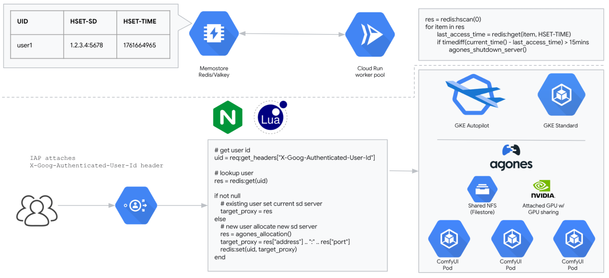
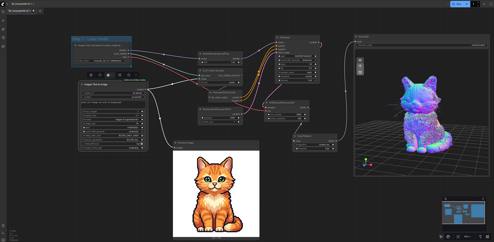
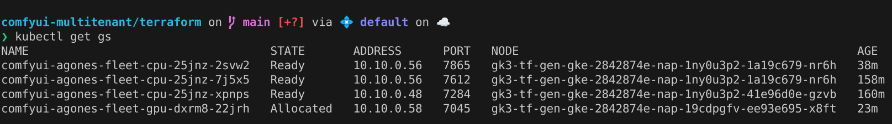
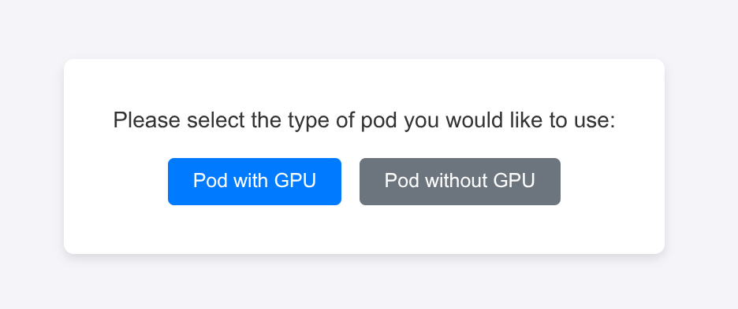

# ComfyUI on GKE Autopilot with Agones - Implementation Guide

This guide walks ComfyUI users through launching a scalable, managed deployment on GKE Autopilot, utilizing Filestore for shared model and output persistence.

For convenient multi-tenant management, we integrate the [Agones](https://agones.dev/site/) runtime operator. This setup ensures each isolated ComfyUI instance runs within its own dedicated Kubernetes Pod, which is allocated to an authorized user and can be spawned with or without a GPU.


## Architecture


## How To

You can use terraform to deploy all the infrastructure and then apply kuberenetes config files (recommended!)
- OR- 
You can use either cloud shell or your to own local environment execure all the steps manually (cluster, redis, filestore, etc creation) via [README-manual-setup.md](README-manual-setup.md)

### Before you begin
1. Make sure you have an available GCP project for your deployment
2. Enable the required service API using [cloud shell](https://cloud.google.com/shell/docs/run-gcloud-commands)
```
gcloud services enable compute.googleapis.com artifactregistry.googleapis.com container.googleapis.com file.googleapis.com vpcaccess.googleapis.com redis.googleapis.com cloudscheduler.googleapis.com cloudfunctions.googleapis.com cloudbuild.googleapis.com
```
3. Exempt below organization policy constraints in your project
```
constraints/compute.vmExternalIpAccess
constraints/compute.requireShieldedVm  
constraints/cloudfunctions.allowedIngressSettings
constraints/iam.allowedPolicyMemberDomains(optional)
```

## Setup

Copy all the templates into a parent folder.
```
cp terraform/terraform.tfvars.template terraform/terraform.tfvars
cp agones/templates/* agones/
cp nginx/templates/* nginx/
cp ingress-iap/templates/* ingress-iap/
```

Edit terraform/terraform.tfvars

```
cd terraform
terraform init
terraform plan
terraform apply
```

Write down the outputs and supply them here:

```
PROJECT_ID=<replace this with your PROJECT ID>
SERVICE_ACCOUNT_EMAIL=<replace with the GCP's service account you want to use>
REGION=<replace this with your region, same as in terraform.tfvars:region>
DOMAIN_NAME=<replace with domain name you want to use, same as in terraform.tfvars:comfyui_domain>
FILESTORE_IP=<replace with terraform output "google_filestore_reserved_ip_range">
COMFYUI_IMAGE=<replace with terraform output "comfyui_image">
GAME_SERVER_IMAGE=<replace with terraform output "game_server_image">
NGINX_IMAGE=<replace with terraform output "nginx_image">
BUILD_REGIST=<replace with terraform output "artifactregistry_name">
STATIC_IP_NAME=<replace with terraform output "comfyui_static_ip_addr_name">
```

### Get credentials of GKE cluster
```
gcloud container clusters get-credentials ${GKE_CLUSTER_NAME} --region ${REGION}
```

# Setting GKE permissions
Update SERVICE_ACCOUNT_EMAIL with you service account for running your GKE cluster and run below command. We need access to Artifact Registry and also we need to bind GKE's SA to our GCP one.
```
gcloud artifacts repositories add-iam-policy-binding ${BUILD_REGIST} \
    --location=${REGION} \
    --member=serviceAccount:${SERVICE_ACCOUNT_EMAIL} \
    --role="roles/artifactregistry.reader"
```
For details, please refer to https://cloud.google.com/kubernetes-engine/docs/troubleshooting#permission_denied_error

### Create GKE cluster Service Account and bind with GCP's service account to be used with the GKE cluster
```
kubectl create sa comfyui-sa

gcloud iam service-accounts add-iam-policy-binding \
  ${SERVICE_ACCOUNT_EMAIL} \
  --role roles/iam.workloadIdentityUser \
  --member "serviceAccount:${PROJECT_ID}.svc.id.goog[default/comfyui-sa]"

kubectl annotate serviceaccount comfyui-sa \
    --namespace default \
    iam.gke.io/gcp-service-account=genai3d-sa@dn-demos.iam.gserviceaccount.com  

gcloud projects add-iam-policy-binding ${PROJECT_ID} \
    --member="serviceAccount:${SERVICE_ACCOUNT_EMAIL}" \
    --role="roles/artifactregistry.reader"

gcloud projects add-iam-policy-binding ${PROJECT_ID} \
    --member="serviceAccount:${SERVICE_ACCOUNT_EMAIL}" \
    --role="roles/file.editor"

gcloud projects add-iam-policy-binding ${PROJECT_ID} \
    --member="serviceAccount:${SERVICE_ACCOUNT_EMAIL}" \
    --role="roles/container.defaultNodeServiceAccount"

gcloud projects add-iam-policy-binding ${PROJECT_ID} \
    --member="serviceAccount:${SERVICE_ACCOUNT_EMAIL}" \
    --role="roles/iam.serviceAccountUser"

gcloud projects add-iam-policy-binding ${PROJECT_ID} \
    --member="serviceAccount:${SERVICE_ACCOUNT_EMAIL}" \
    --role="roles/aiplatform.user"    
```

## Deploying everything on Kubernetes

To deploy ComfyUI agones deployment, please replace the image URL in the deployment.yaml and fleet yaml with the image built(nginx, optional agones-sidecar and comfyui) before.
```

FILESTORE_IP=$(gcloud filestore instances describe ${FILESTORE_NAME} --zone=${REGION} --format=json | jq '.networks[0].ipAddresses[0]')

cd agones

sed -i "s@<FILESTORE_IP>@${FILESTORE_IP}@g" pv.yaml
kubectl apply -f agones/pv.yaml
kubectl apply -f agones/pvc.yaml

sed -i "s@<REGION>@${REGION}@g" fleet-cpu.yaml
sed -i "s@<REGION>@${REGION}@g" fleet-gpu.yaml
sed -i "s@<PROJECT_ID>/<BUILD_REGIST>@${PROJECT_ID}/${BUILD_REGIST}@g" fleet-cpu.yaml
sed -i "s@<PROJECT_ID>/<BUILD_REGIST>@${PROJECT_ID}/${BUILD_REGIST}@g" fleet-gpu.yaml
cd -

cd nginx
sed -i "s@<REDIS_HOST>@${REDIS_HOST}@g" deployment.yaml
sed -i "s@<REGION>@${REGION}@g" deployment.yaml
sed -i "s@<PROJECT_ID>/<BUILD_REGIST>@${PROJECT_ID}/${BUILD_REGIST}@g" deployment.yaml
cd -

kubectl apply -f nginx/deployment.yaml
kubectl apply -f agones/role-bind.yaml
kubectl apply -f agones/fleet-cpu.yaml
kubectl apply -f agones/fleet-gpu.yaml
kubectl apply -f agones/fleet_autoscale.yaml
```

### Deploy IAP(identity awared proxy)
To allocate isolated ComfyUI runtime and provide user access auth capability, we will use Google Cloud IAP service as an access gateway to provide the identity check and prograge the idenity to the ComfyUI backend.

Config the [OAuth consent screen](https://developers.google.com/workspace/guides/configure-oauth-consent) and [OAuth credentials](https://developers.google.com/workspace/guides/create-credentials#oauth-client-id), then configure [identity aware proxy for backend serivce on GKE](https://cloud.google.com/iap/docs/enabling-kubernetes-howto#oauth-configure).

After we create OAuth 2.0 Client IDs under OAuth credentials, we need to update the Client ID with "Authorized redirect URIs". Value looks something like this:
```
https://iap.googleapis.com/v1/oauth/clientIds/<xxx-xxx.apps.googleusercontent.com>:handleRedirect
```
where xxx-xxx.apps.googleusercontent.com is the Oauth 2.0 client ID you just created.


Now for BackendConfig configuration, replace the client_id and client_secret with the OAuth client created above.
```
kubectl create secret generic iap-secret --from-literal=client_id=${CLIENT_ID} \
    --from-literal=client_secret=${CLIENT_SECRET}
```
Change the DOMAIN_NAME in managed-cert.yaml with the your domain and STATIC_IP_NAME with the name of static IP allocated for the service and then apply the configuration:
```
cd ingress-iap/
sed -i "s@<STATIC_IP_NAME>@${STATIC_IP_NAME}@g" ingress.yaml
sed -i "s@<DOMAIN_NAME>@${DOMAIN_NAME}@g" ingress.yaml
sed -i "s@<DOMAIN_NAME>@${DOMAIN_NAME}@g" managed-cert.yaml
cd ..
kubectl apply -f ./ingress-iap/managed-cert.yaml
kubectl apply -f ./ingress-iap/backendconfig.yaml
kubectl apply -f ./ingress-iap/service.yaml
kubectl apply -f ./ingress-iap/ingress.yaml
```
Give the authorized users required priviledge to access the service. [Guide](https://cloud.google.com/iap/docs/enabling-kubernetes-howto#iap-access) \
**Note: if you wish to add IAP users out of your organziation, set your application's "User Type" from "internal" to "external" in "Oauth consent screen".**

### Update DNS record for the domain
Update your DNS record by setting A record value to $(gcloud compute addresses describe comfyui-agones --global --format=json | jq .address) for the domain used in managed-cert.yaml
The Google-managed certificate won't be provisioned successfully unless the domain is already associated with the ingress external IP,
check out the [guide, see step 8](https://cloud.google.com/kubernetes-engine/docs/how-to/managed-certs)

### Access the service domain
Now you should be able to open your domain, login with IAP authorized account and access ComfyUI.

### Clean up
```
terraform destroy
```

OR

```
kubectl delete -f ./ingress-iap/managed-cert.yaml
kubectl delete -f ./ingress-iap/backendconfig.yaml
kubectl delete -f ./ingress-iap/service.yaml
kubectl delete -f ./ingress-iap/ingress.yaml

gcloud container clusters delete ${GKE_CLUSTER_NAME} --region=${REGION}

gcloud compute addresses delete comfyui-agones --global

gcloud scheduler jobs delete comfyui-agones-cron --location=us-central1
gcloud functions delete redis_http --region=${REGION} 

gcloud compute networks vpc-access connectors delete comfyui-agones-connector --region ${REGION} --async

gcloud artifacts repositories delete ${BUILD_REGIST} \
    --location=${REGION}$ --async

gcloud redis instances delete --project=${PROJECT_ID} comfyui-agones-cache --region ${REGION}
gcloud filestore instances delete ${FILESTORE_NAME} --zone=${FILESTORE_ZONE}
```

## FAQ
### How could I troubleshooting if I get 502?
It is normal if you get 502 before pod is ready, you may have to wait for a few minutes for containers to be ready(usually less than 10mins), then refresh the page.
If it is much longer then expected, then

1. Check stdout/stderr from pod
To see if comfyui has been launched successfully
```
kubectl logs -f pod/comfyui-agones-fleet-xxxxx-xxxxx -c comfyui
```
2. Check stderr from nginx+lua deployment
```
kubectl logs -f deployment/comfyui-nginx-deployment
```
3. Check redis keys
Clear all keys from redis before reusing it for new deployment
```
redis-cli -h ${redis_host}
keys *
flushall
```
4. Check cloud scheduler & cloud function, the last run status should be "OK", otherwise check the logs.

### Why there is a simple-game-server container in the fleet?
This is an example game server from agones, we leverage it as a game server sdk to interact with agones control plane without additional coding and change to comfyui.
The nginx+lua will call simple-game-server to indirectly interact with agones for resource allocation and release.

## Preview





